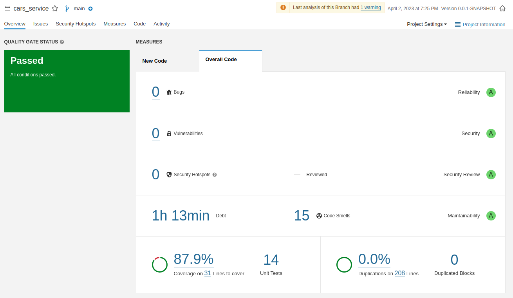
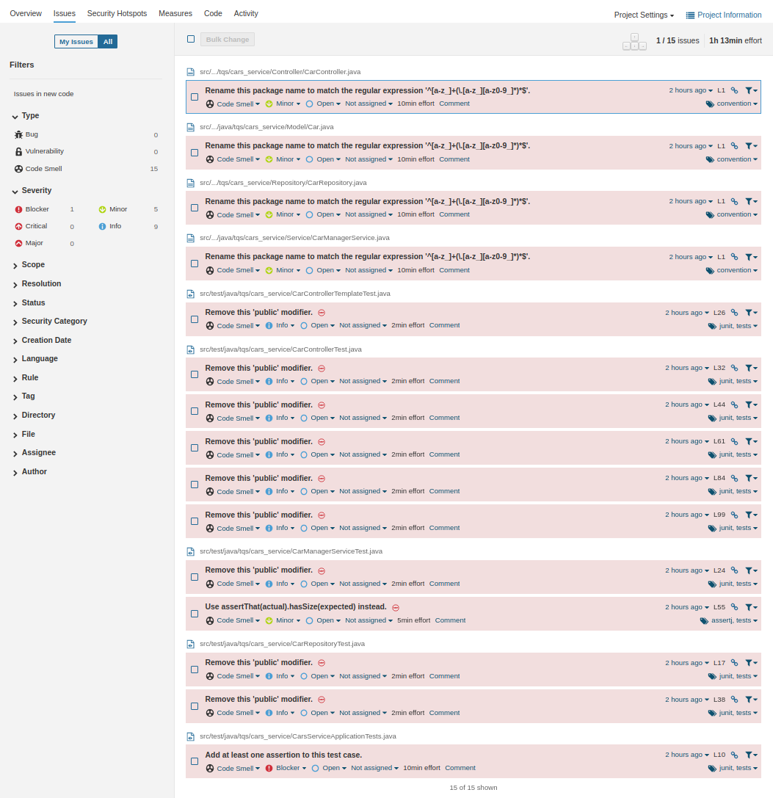
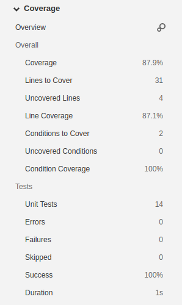

# **Lab6_1 - Local Analysis**

</br>

## Running SonarQube Server

```bash
docker run -d --name sonarqube -e SONAR_ES_BOOTSTRAP_CHECKS_DISABLE=true -p 9000:9000 sonarqube:latest
```

Once your instance is up and running, Log in to [http://localhost:9000](http://localhost:9000/) and change the default admin authentication password.

</br>

## Test Results

Upon preforming the following command:

```bash
mvn clean verify sonar:sonar -Dsonar.projectKey=lab6_1local_analysis -Dsonar.host.url=http://localhost:9000 -Dsonar.login=sqp_faaa68ce5b43ec5f1e8b613bb52f4bc4f66b8498
```

My project successfully passed the defined quality gate, with a total of 0 bugs, 0 vulnerabilities and 0 Security Hotspot.



In order to analyze the coverage, it was required to install the Jacoco plugin, in the [pom.xml](./pom.xml).

### **Debt**

Debt is the the estimated amount of effort (using time), it is expected to take in order to solve all code smells detected. In my code it was **1h13min**.

</br>

### **Issues**

These are all of the code smells detected during the test. They is not harmful to the code, since none of them is marked with critical or major severity.



### **Coverage**

Code coverage is a measurement of the amount of code that is run by unit tests - either lines, branches, or methods. With Jacoco installed, we could test the coverage, that resulted in 87.9% (with 4 uncovered lines and 0 uncovered conditions).

**Note**: The Jacoco plugin, doesn't change the value of debt and the number of issues.

These is the rest of the values returned by the report:


